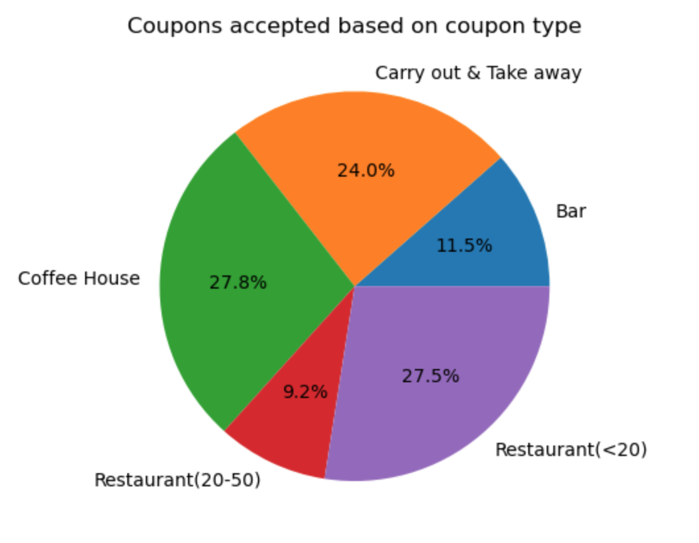
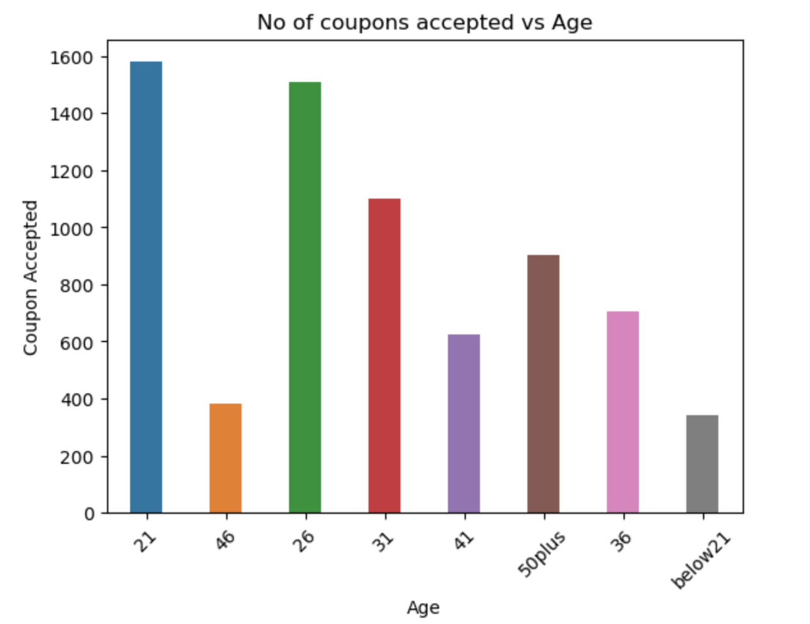
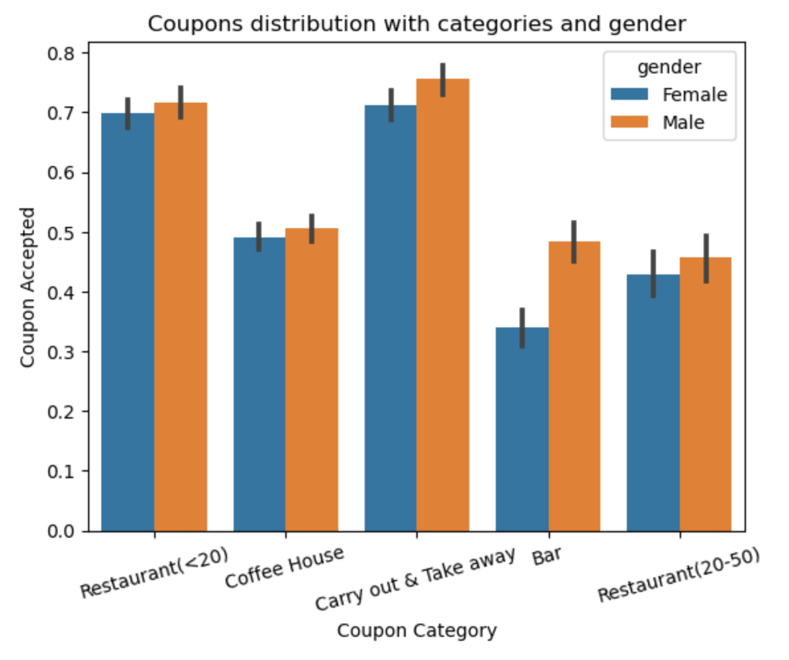
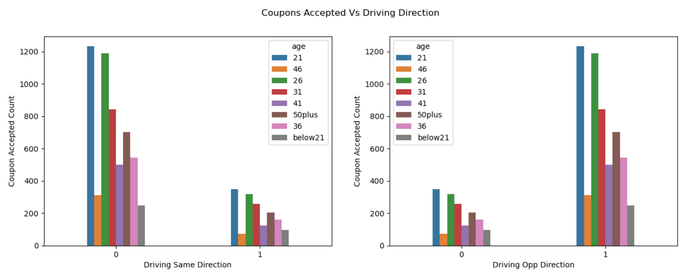

# Coupon Data Analysis

## Introduction

   This project involves data analysis using the [coupons dataset](data/coupons.csv). The objective is to identify patterns in the data and predict or recommend actions to enhance the effectiveness of the coupons.

For more details, you can refer to the dataset description [here](https://archive.ics.uci.edu/dataset/603/in+vehicle+coupon+recommendation).

## Data Cleanup

   The coupons dataset contains raw data that requires cleaning before analysis. I used Python libraries [pandas](https://pandas.pydata.org) and [numpy](https://numpy.org) for the data cleanup.

Key steps taken:
- Renamed the column 'Y' to 'coupon_accepted' for clarity.
- Replaced 'less1' values with 'never', as both indicate fewer than one visit.
- Performed usual operations like fillna, dropna, and removing duplicates.

The cleaned dataset has been saved as [coupons_processed](data/coupons_processed.csv) and can be used for further analysis or other purposes as needed.

## Visualizations

 Visualizations make it easier to understand data compared to raw tabular formats. For these visualizations, I used [matplotlib](https://matplotlib.org) and [seaborn](https://seaborn.pydata.org).

Key visualizations include:
- Pie charts to show the rate of coupon acceptance.
- Bar plots to explore features and their values.
- Count plots to display patterns in categorical data.

Here are a few examples of these visualizations:

   
  
## Conclusion

   This project showcased the use of various Python libraries for data analysis and visualization. Additionally, there are other libraries worth considering, such as [plotly](https://plotly.com/python/) for creating advanced visualizations.